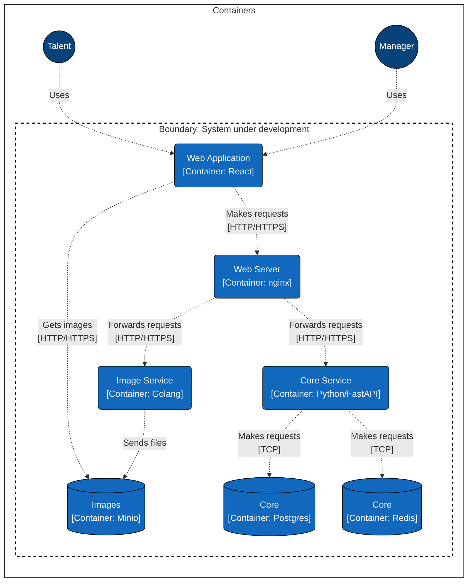

## Инфраструктура/Архитектура проекта
### Диаграмма контейнеров C4

```mermaid
graph LR
    %% C4 style classes c4model.com %%
    classDef person fill:#08427b,stroke:black,color:white;
    classDef container fill:#1168bd,stroke:black,color:white;
    classDef database fill:#1168bd,stroke:black,color:white;
    classDef software fill:#1168bd,stroke:black,color:white;
    classDef existing fill:#999999,stroke:black,color:white;
    classDef boundary fill:white,stroke:black,stroke-width:2px,stroke-dasharray: 5 5;
    classDef frame fill:white,stroke:black;


    %% nodes %%
    Manager((Manager)):::person
    Talent((Talent)):::person
    WebApp("Web Application<br>[Container: React]"):::container
    WebServer("Web Server<br>[Container: nginx]"):::container
    ImageService("Image Service<br>[Container: Golang]"):::container
    ImageStorage[("Images<br>[Container: Minio]")]:::database
    CoreService("Core Service<br>[Container: Python/FastAPI]"):::container
    CoreDB[("Core<br>[Container: Postgres]")]:::database
    CoreCache[("Core<br>[Container: Redis]")]:::database

    %% connections and boundaries %%
    
    subgraph Legend [Containers]
        Manager-.->|Uses| WebApp
        Talent-.->|Uses| WebApp
        subgraph Boundary["Boundary: System under development"]
            WebApp-.->|"Makes requests <br> [HTTP/HTTPS]"| WebServer
            WebServer-.->|"Forwards requests <br> [HTTP/HTTPS]"| ImageService
            ImageService-.->|"Sends files"|ImageStorage
            WebApp-.->|"Gets images <br> [HTTP/HTTPS]"| ImageStorage
            WebServer-.->|"Forwards requests <br> [HTTP/HTTPS]"|CoreService
            CoreService-.->|"Makes requests<br> [TCP]"|CoreDB
            CoreService-.->|"Makes requests<br> [TCP]"|CoreCache
        end
        class Boundary boundary
    end
    class Legend frame
```